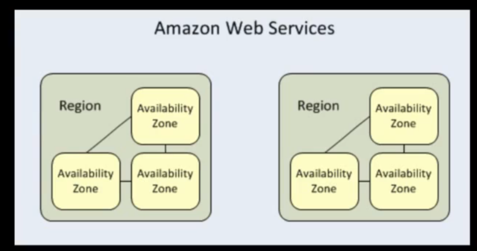
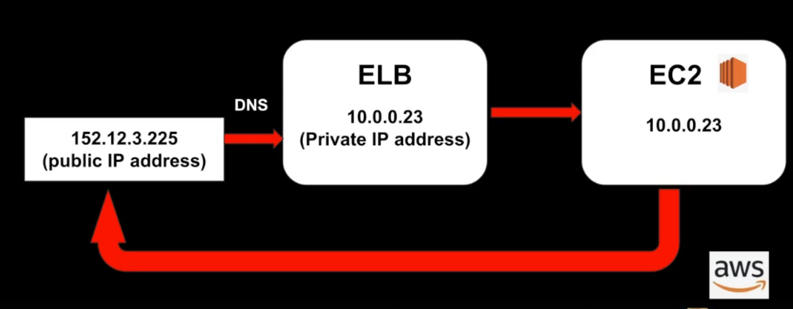

# 02. EC2

### 1. EC2

- elastic compute cloud

- 컴퓨터를 유동적으로 빌려 사용

### 2. 지불방법

- On-demand
  - 시간 단위로 비용 지불
- Reserved
  - 일정기간을 대여해서 사용
  - 크기가 고정되어 있음
  - 비교적 저렴

- Spot
  - 경매로 구매
  - 개발의 시작과 끝에 구애받지 않고 오로지 가격만을 고려할 때 사용
  - 가격범위내에서 인스턴스가 시작되고 벗어나면 종료됨

### 3. EBS

- EC2 인스턴스에 부여되는 저장공간

- 디스크 볼륨위에 File System이 부착

  - 디스크: 물리적인 저장장치
  - File System: 데이터를 조직화하고 저장하는 방법

- EBS는 특정 Availablility Zone (AZ)에 생성됨

  - 

  - EC2를 사용시 AZ를 설정해주어야 함
  - Disaster Recovery에 매우 중요

### 4. EBS 볼륨타입

- SSD군
  - GP2: 최대 10K IOPS지원, 1GB당 3IOPS 속도
  - I01: 극도의 I/O률을 요구하는 환경에서 사용, 10K 이상의 IOPS
    - IOPS란?: 한 번의 초당 입출력 작업 횟수, 데이터 스토리지 시스템의 성능을 측정하는 데 사용

- HDD군
  - ST1: 빅데이터 datawarehouse, log 프로세싱
  - SC1: 파일서버와 같은 드문 volume 접근 시 사용
  - Sandard: 디스크 1GB당 가장 저렴, Boot Volume으로 유일하게 사용
    - 파일서버: 다른 컴퓨터나 장치가 파일을 저장하고 접근할 수 있도록 중앙화된 저장소
    - Boot Volume: 부팅하는 데 사용되는 볼륨 또는 디스크, ex.)운영 체제의 핵심 파일

### 5. ELB

- elastic load balancers: traffic 분산
- Application Load Balancers (ALB)
  - OSI 7계층에서 사용
  - HTTP, HTTPS같은 traffic을 처리
  - 고급 request 라우팅 설정으로 특정 서버로 request를 보낼 수 있음
- Network Load Balancers (NLB)
  - OSI 4계층에서 사용
  - TCP traffic을 처리
  - 초당 수백의 request를 한번에 처리
- Classic Load Balancer
  - 현재는 Legacy로 거의 쓰이지 않음
  - 7, 4 traffic 라우팅 기능 지원

X-Forwarded-For 헤더

- 프록시 서버나 로드 밸런서를 통해 전달된 원본 클라이언트 IP 주소를 식별하기 위해 사용
- 

### 6. Route 53

- aws에서 제공하는 DNS 서비스

### 7. Putty

- Windows 운영체제에서 널리 사용
- SSH로 원격 서버에 안전하게 접속 오픈 소스 터미널 에뮬레이터

- EC2 인스턴스 생성 후 키페어 생성 -> putty를 사용하여 SSH 원격접속
